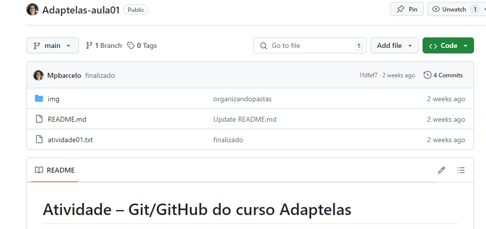
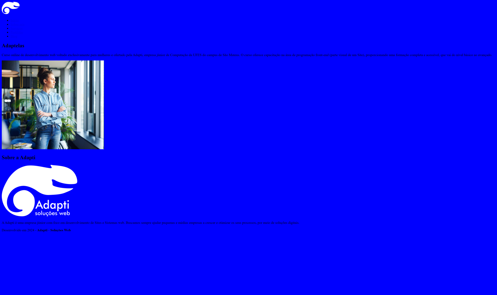
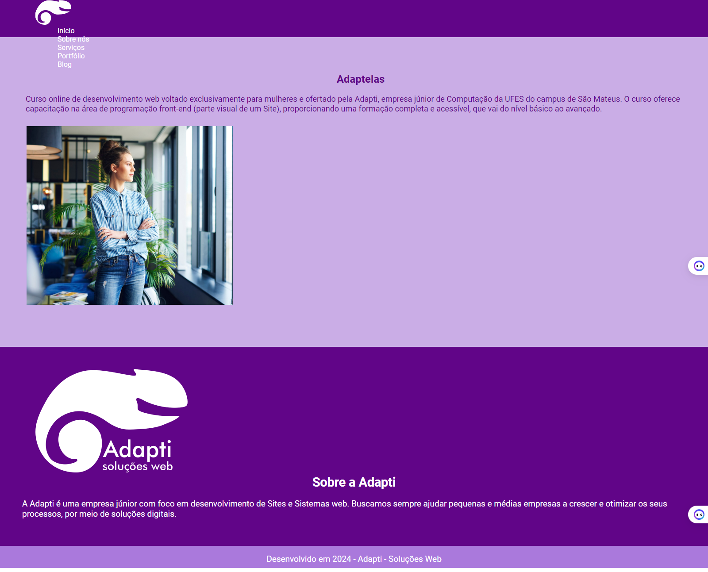
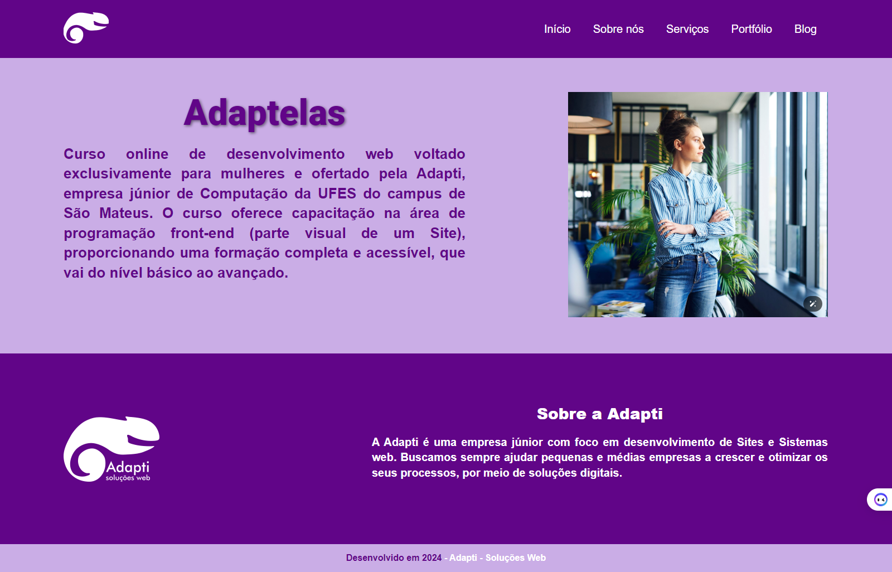
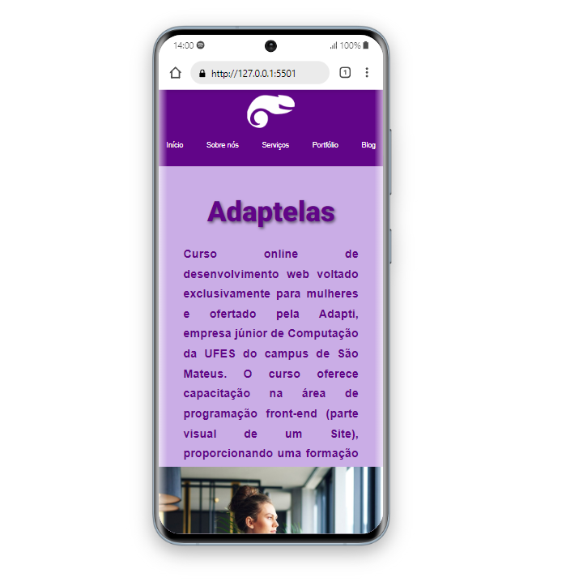

# Tarefa 01 - Git/GitHub

## Descrição

1) Instalação do VSCode
2) Instalação do Git
3) Criação de uma conta no GitHub
4) Criação de um repositório no GitHub e realização do primeiro Commit de um arquivo de texto falando o que você achou da aula e o que espera do Adaptelas

# Tarefa 02 - Fundamentos de HTML

## Descrição

Criando o esqueleto da nossa página web. Nesta tarefa,  utilizamos as tags HTML apresentadas em sala para montar toda a estrutura do site. Sem estilização, pois vamos aprender isso nas próximas aulas.

# Tarefa 03 - Fundamentos de CSS 

## Descrição

Utilizando a estrutura feita na atividade de Fundamentos de HTML, estilizamos os
textos, margens e cores da página para que ela fique da seguinte forma:

# Tarefa 04 Usando Displays

## Descrição
Usando os displays para deixar o site organizado.

# Tarefa 05 Design Responsivo

## Descrição
 Design Responsivo, utilizando media query para permitir que o site se torne responsivo.

